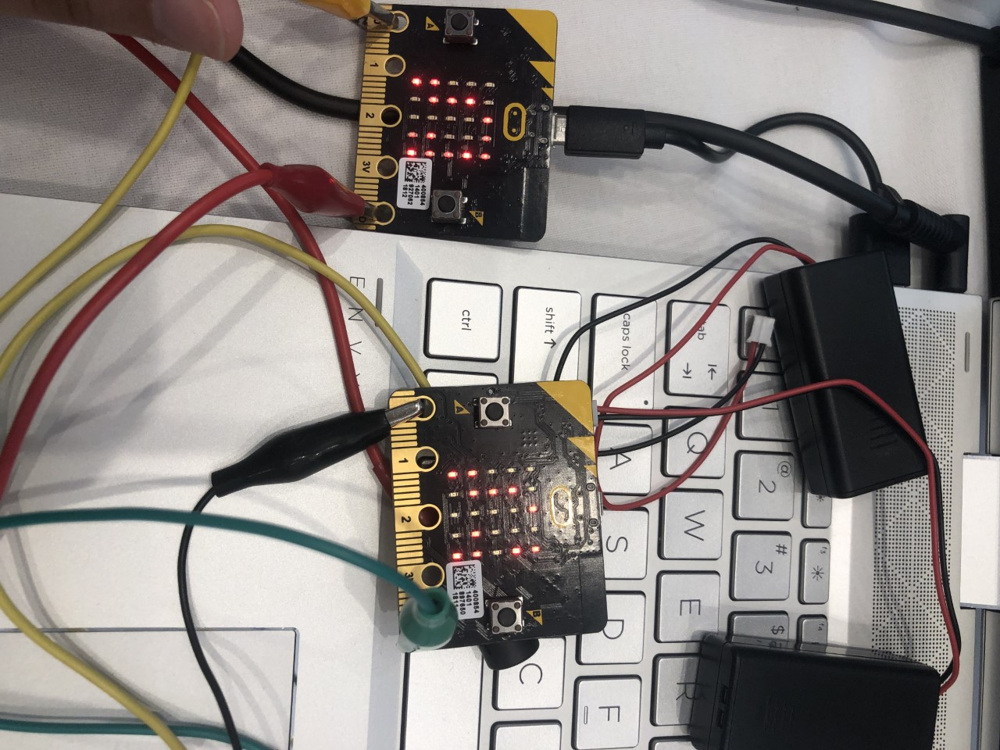

# Here Comes The Sun 

<!-- Note, the line below this one is what links to your screenshot, **DO NOT REMOVE** -->

<!--
In this file, you should write a brief description of what your
project is, what you learned, and a simple screenshot of your work.

To add a screenshot, please replace `screenshot.png` with
your own screenshot.
-->

## SoarCS 2019

For our project we used two microbits along with the radio function to play "Here Comes The Sun" by The Beatles. Each one was programmed to be the different guitars used in the original.  
